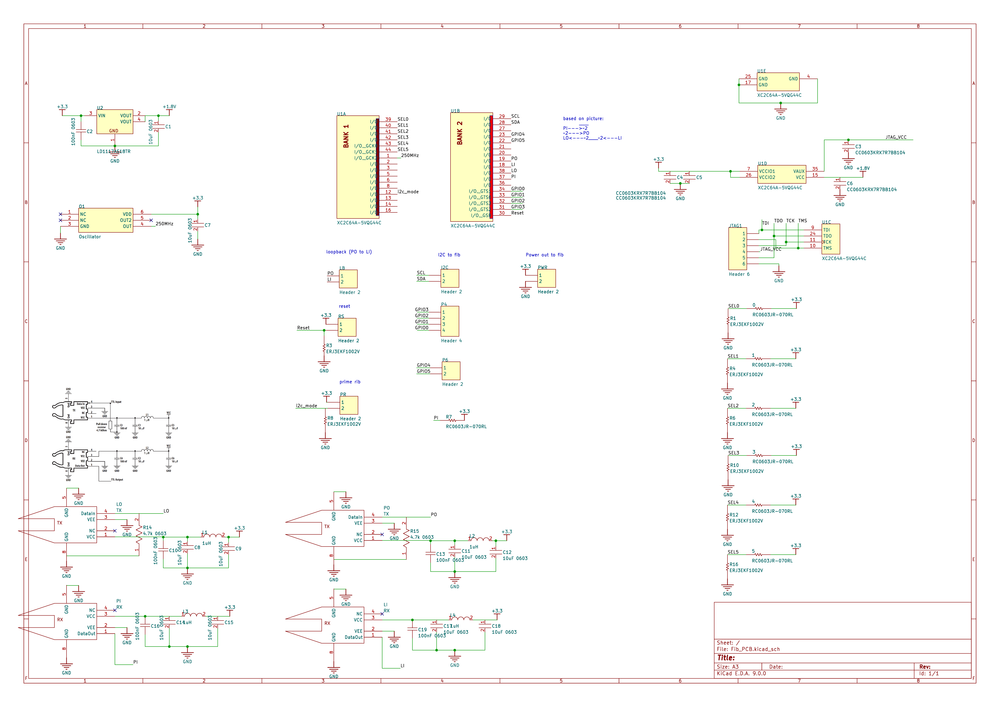
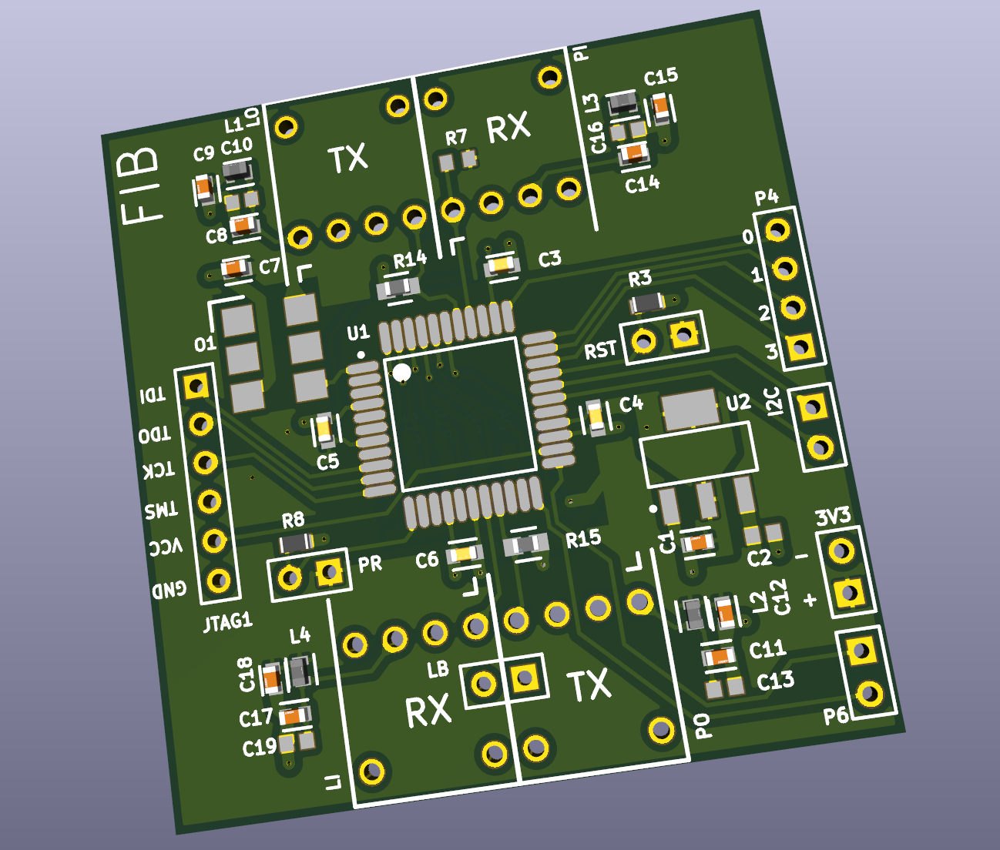

# Fiber Optic Based Signal Extender

A high-speed hardware system designed to transmit and replicate electrical signals over long distances using fiber optics with minimal latency.

## Overview

This project consists of two custom PCB systems designed for high-speed signal replication across fiber:

- **Transmitter/Receiver Board:** FPGA-based PCB for protocol-agnostic electrical signal replication over fiber with ~30 ns latency.
- **Motor Controller Board:** STM32-based H-Bridge driver interfaced via I2C through the fiber optic system.

The design demonstrates a full end-to-end communication system without electrical coupling, ideal for applications where noise isolation or long-distance communication is required. This was my capstone project for my Advanced Embedded Systems course at the University of Michigan, and was worked on by a team of five. I contributed heavily and mainly to the hardware development and testing, while collaborating closely with teammates on software and system integration and validation.

## Features

- Custom fiber optic communication protocol with latency < 30 ns
- Supports arbitrary digital signal formats (protocol-agnostic)
- Isolated end-to-end data replication
- STM32 motor controller with I2C command input
- Integrated H-Bridge for direct motor control

## Photos

Fiber Optic Board mounted on top of a motor controller board.

Half-Assembled Fiber Optic Board

Schematic

Layout

## Poster Describing Project
